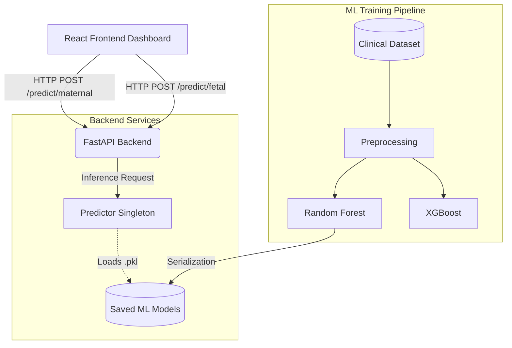

# Maternal-Fetal Risk System 🩺🤰


A comprehensive, two-tier AI-driven predictive architecture designed to assess maternal health risks and fetal distress using clinical vital signs and Cardiotocogram (CTG) data.

> **⚠️ DISCLAIMER:** This project is for **educational and research purposes only**. The machine learning models and heuristics provided are not intended to replace professional medical diagnosis, clinical judgment, or treatment decisions.

---

## 🌟 Key Features

### 1. 🏥 Clinical Dashboard (Frontend)
- **Role-Based Access:** Designed to accommodate both healthcare professionals (Clinical Dashboard) and patients (Vitals Logging).
- **Patient Profiles:** Detailed views of patient history, gestational age, and risk status.
- **Dynamic Vitals Visualization:** Interactive charts tracking Blood Pressure, Heart Rate, and Blood Sugar over time.
- **Fetal Assessment Tool:** A built-in calculator to evaluate CTG metrics and predict fetal distress.

### 2. 🧠 Machine Learning Pipeline
- **Predictive Modeling:** Compares Random Forest and XGBoost to classify maternal risk (Low, Mid, High) based on clinical vitals.
- **Healthcare-First Metrics:** Optimized for **High-Risk Recall** to minimize false negatives in critical situations.
- **Interpretability:** Includes feature importance analysis (native & permutation) to explain which vitals drive risk predictions.
- **Fairness Audits:** Built-in demographic parity and equal opportunity checks to ensure unbiased predictions.

### 3. ⚙️ Robust API (Backend)
- **FastAPI Server:** High-performance, asynchronous REST API serving the trained ML models.
- **Lifespan Management:** Models are loaded efficiently into memory at startup as singletons.
- **Graceful Fallbacks:** The frontend gracefully falls back to clinical heuristics if the ML backend is offline.

---

## 🛠️ Technology Stack

| Domain | Technology |
|---|---|
| **Frontend** | React, Vite, Lucide-React, Recharts |
| **Backend** | Python, FastAPI, Uvicorn, Pydantic |
| **Machine Learning** | Scikit-Learn, XGBoost, Pandas, Numpy, Matplotlib, Seaborn |

---

## 🏗️ Architecture Overview



---

## 🚀 Setup & Installation

### Prerequisites
- [Node.js](https://nodejs.org/) (v18+)
- [Python](https://www.python.org/) (3.10+)
- [Git](https://git-scm.com/)

### 1. Clone the Repository
```bash
git clone https://github.com/yourusername/maternal_fetal_risk_system.git
cd maternal_fetal_risk_system
```

### 2. Backend & ML Pipeline Setup
Open a terminal and navigate to the `backend` directory:

```bash
cd backend

# Install dependencies
pip install -r requirements.txt
pip install -r ml/requirements_ml.txt

# Run the ML Training Pipeline (Generates the models)
cd ml
python maternal_risk_pipeline.py

# Start the FastAPI Server
cd ..
uvicorn app.main:app --reload --port 8000
```
*The API will be available at `http://localhost:8000`. You can view the interactive documentation at `http://localhost:8000/docs`.*

### 3. Frontend Setup
Open a **new** terminal and navigate to the `frontend` directory:

```bash
cd frontend

# Install dependencies
npm install

# Start the development server
npm run dev
```
*The React app will be available at `http://localhost:5173`.*

---

## 📊 Using the System

1. **Dashboard:** Navigate to `http://localhost:5173/clinical/patients` to view the mock patient roster.
2. **Patient Details:** Click on any patient to view their longitudinal vitals data and trend charts.
3. **Fetal Assessment:** In the patient detail view, use the right-hand panel to input simulated CTG metrics (e.g., Abnormal STV, Accelerations) to trigger a real-time fetal risk assessment from the backend.
4. **Offline Mode:** If you terminate the FastAPI server, the frontend will automatically fall back to hardcoded clinical heuristics, ensuring continuous operation.

---

## 📁 Project Structure

```text
maternal_fetal_risk_system/
├── backend/
│   ├── app/
│   │   ├── main.py             # FastAPI entry point & routes
│   │   ├── predictor.py        # ML Model inference wrapper
│   │   └── schemas.py          # Pydantic validation schemas
│   └── ml/
│       ├── maternal_risk_pipeline.py # Model training & evaluation
│       └── outputs/            # Generated models and EDA plots
│
├── frontend/
│   ├── src/
│   │   ├── api/                # API client with graceful fallbacks
│   │   ├── components/         # Reusable UI elements (Charts, Badges)
│   │   ├── layouts/            # Page shell layouts
│   │   └── pages/              # Dashboard and Patient views
│   └── index.html
└── README.md
```

---

## 🤝 Contributing
Contributions, issues, and feature requests are welcome! Feel free to check the [issues page](https://github.com/yourusername/maternal_fetal_risk_system/issues).

## Developing Team
Faraz Shoukat @farazshoukat
Musadiq Qaysir @MusadiqQaysir7860

## 📄 License
This project is licensed under the MIT License - see the LICENSE file for details.
